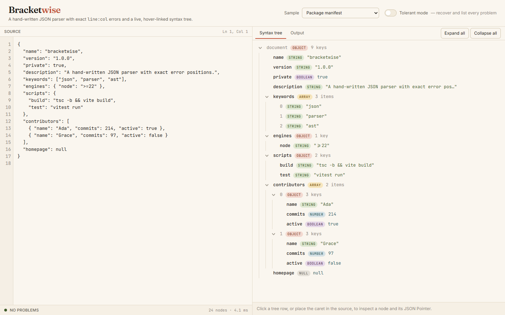
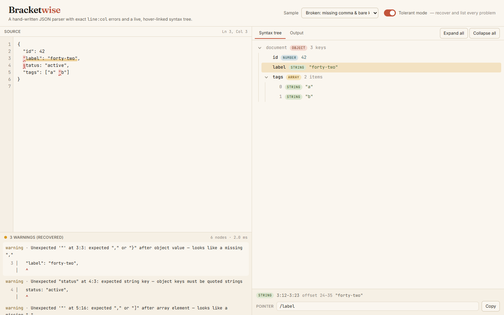

# Bracketwise

A hand-written JSON parser that reports exact `line:column` errors with a caret, and renders
the result as a collapsible AST with hover-to-highlight source ranges.



Hover any row in the tree and its exact byte range lights up in the source with a
marker-pen underline; hover the source and the owning row lights up. Break the document
and you get a message like
`Unexpected '"' at 3:3: expected "," or "}" after object value — looks like a missing ","`
with the offending line and a red caret under the character.



## Features

- **Recursive-descent parser (RFC 8259), from scratch** — objects, arrays, strings with every
  escape including `\uXXXX` surrogate pairs, numbers via the RFC grammar state machine
  (sign, int, frac, exp), `true` / `false` / `null`. No regexes, no `JSON.parse`.
- **Positions on everything** — every node carries `start`/`end` offsets and
  `loc: { start: {line, col}, end: {line, col} }`. Errors carry `offset`, `line`, `col`,
  `expected[]`, `found`, an optional hint, and format to a one-line excerpt plus caret.
- **Collapsible tree** with type badges, key/item counts and string/number previews.
  Rows slide open with a 120 ms height transition. Click a row to select its source range;
  place the caret in the source and the tree follows.
- **Bidirectional hover** — tree row to source range, source character to tree row.
- **JSON Pointer (RFC 6901)** for the selected node, with `~0` / `~1` escaping and a copy button.
- **Tolerant mode** — recovers from trailing commas, comments, missing commas, bad literals
  and unterminated strings, and lists every problem as a warning instead of stopping at the first.
- **Pretty-print / minify** driven by the AST rather than `JSON.stringify`: numbers keep their
  source spelling (`2.5e3` stays `2.5e3`), indent is 2, 4 or tab.
- **Six built-in samples**, three of them deliberately broken, one per common error class.
- Keyboard navigation in the tree (arrows, Home/End, Enter, Space), responsive down to 380 px,
  empty states, zero console errors.

## How it works

**Parsing.** `Parser` walks the UTF-16 string once with a cursor that tracks `offset`,
`line` and `col` (a `\r\n` pair counts as one line break). Each production —
`parseValue`, `parseObject`, `parseArray`, `parseString`, `parseNumber`, `parseLiteral` —
records a mark before it starts and calls `finish()` when it is done, which stamps the node
with its `start`/`end` offsets and `loc`. Object members are value nodes carrying a `key`
with its own range, so `"name": "Ada"` becomes one string node whose highlight covers the
key as well. When a production sees something it cannot use it calls `fail(expected, ...)`,
which builds a `ParseError` with `found` derived from the cursor (`'"'`, `"tru"`,
`line break`, `end of input`) and, in strict mode, throws it. A few hints are attached
where the cause is obvious (`trailing commas are not allowed in JSON`,
`JSON literals are lowercase: true`, `strings cannot contain raw line breaks`).

```
{"a": 1 "b": 2}
        ^
Unexpected '"' at 1:9: expected "," or "}" after object value — looks like a missing ","
```

**Tolerant mode** swaps the throw for a recorded diagnostic. Problems the parser can step
over (a trailing comma, a missing comma, a leading zero, a comment) are reported and parsing
continues in place. Anything else throws an internal `RESYNC` signal that the nearest
container catches; it then skips forward to the next `,` or its own closing bracket,
stepping over whole strings and balanced brackets on the way, and picks up from there.
The result is a partial tree plus a list of every problem found.

**Hover lookup.** After parsing, `indexTree` flattens the tree into a list of disjoint
source intervals, each owned by the deepest node that covers it — a container owns the gaps
between its children (`{`, `,`, whitespace, `}`) and a leaf owns its own text. For
`{"x": [0, 12]}` the intervals are:

```
offset   owner   text
[0,1)    ""      {
[1,7)    /x      "x": [        (the key and colon belong to the value)
[7,8)    /x/0    0
[8,10)   /x      ,␠
[10,12)  /x/1    12
[12,13)  /x      ]
[13,14)  ""      }
```

A mouse position over the editor is converted to an offset with monospace grid math
(tabs expanded), and a binary search over the interval starts gives the node in
O(log n). The editor itself is a transparent `<textarea>` over a `<pre>` mirror that
renders the same text with `<span>` marks for the hovered range, the selected range and
each diagnostic.

## Run

```sh
npm install
npm run dev        # local dev server
npm run build      # type-check (strict) and build to dist/
npm test           # vitest: parser, positions, error messages, tolerant recovery, pointer, printer, samples
```

## Tech

Vite 8, React 19, TypeScript 6 (strict, `erasableSyntaxOnly`), Tailwind CSS 4, Vitest 5.
Fonts from `@fontsource`: JetBrains Mono, Fraunces, Inter. No runtime dependencies beyond React.

## Notes

- Columns count UTF-16 code units, the same convention editors use; an astral character
  such as an emoji in the source occupies two columns.
- A `"__proto__"` key becomes an ordinary own property (`Object.defineProperty`), matching
  `JSON.parse` rather than mutating the prototype.

## License

MIT — Copyright (c) 2026 Jafn
